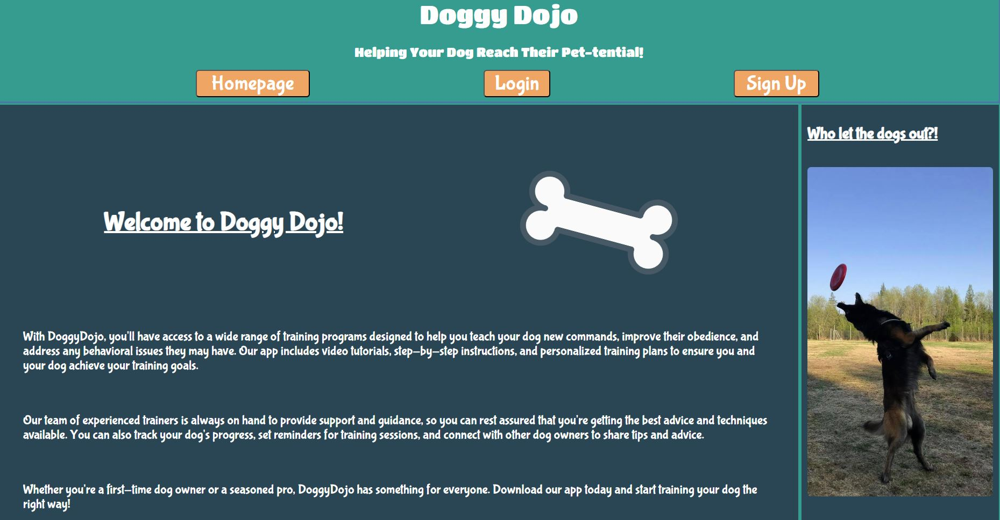

# Doggy Dojo

## Table of Contents

- [Description](#description)
- [Installation](#installation)
- [Usage](#usage)
- [Screenshots](#screenshots)
- [Deployment](#deployment)
- [Technologies](#technologies)
- [Team](#team)
- [License](#license)

## Description

Doggy Dojo is MERN-stack single-page web application (PWA) that allows dog owners and trainers to track the progress of their dogs' training regimen.

## Installation

```npm i``` then ```npm start```

## Usage 

- Users sign in to create a profile.
- Users are prompted with questions, including:
  - What size is your dog? Small | Medium | Large
  - How active is your dog? Cough potato | Loves a long walk | Bouncing off the walls
  - What kind of training are you looking for? Agility | Obedience | Show
- By answering these prompts, the user will be given a checklist specific to their dog.
- As users check boxes, they have the ability to write notes about their dog’s progress.
- The user can choose to update and delete notes as well.

## Screenshots




## Deployment

[Doggy Dojo](https://doggydojo.herokuapp.com/)

## Technologies

* HTML
* CSS  
* JavaScript
* React.js
* Node.js
* Express.js
* Express-session
* Mongoose
* Graphql
* Apollo-Server-Express
* Dotenv
* Bcrypt
* Eslint
* Concurrently
* Nodemon

## Team

- [carsonadair](https://github.com/carsonadair)
- [kkarrwrites](https://github.com/kkarrwrites)
- [Reptartheman](https://github.com/Reptartheman)
- [TioMeko](https://github.com/TioMeko)
 
## License

[](https://opensource.org/licenses/MIT)
